# Ecobee3 and Node Red Integration
This project allows you to read the temperature and occupancy from your Ecobee3 thermostat and remote sensors. Future development will include making updates to your thermostat through Node Red.

## Installation and Set Up
### Node Red Install
If you do not have Node Red installed already, I have written a [Windows-based installation tutorial located here](https://github.com/tfatykhov/WinkRedNode/blob/master/README-Local-Windows.md). Make sure you have Node Red fully up and running to be able to utilize this project's flow.

### Create an Application; Get an API Key
1. Log in to [Ecobee.com](http://www.ecobee.com/), use the 3 line menu button on the top right of Ecobee's website, then select `Developer` from the menu.
2. Create a new application - such as `EcobeeNodeRed` - and type a brief summary such as `Integration of Ecobee with Node Red`
3. Change `Authorization method` to `ecobee PIN`.
4. Save your new application.
You will now have an application API key -- save this, as we will need it for our flow!

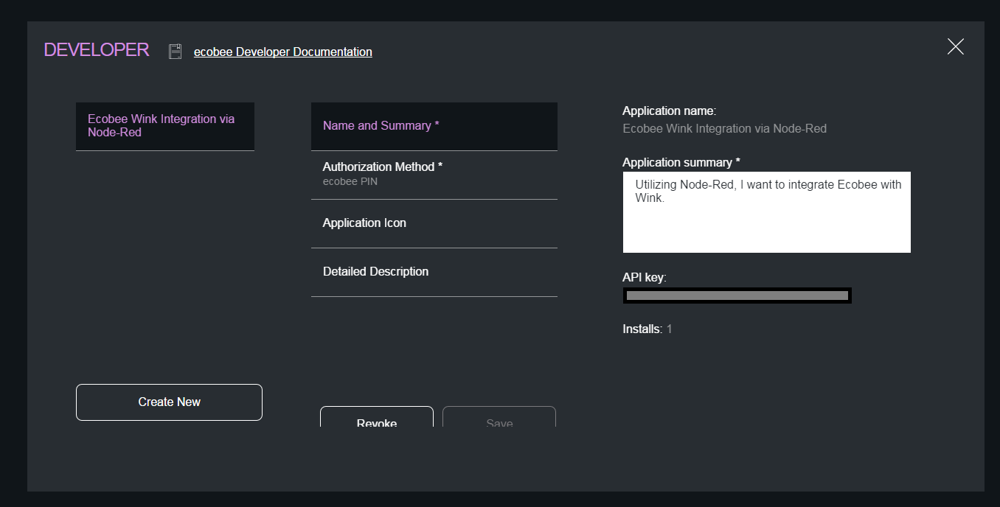

### Import flow into Node Red
Next, import the Node Red flow located here: 
> [https://raw.githubusercontent.com/mifbody/EcobeeNodeRed/master/ecobee-Local.json](https://raw.githubusercontent.com/mifbody/EcobeeNodeRed/master/ecobee-Local.json)

-or-

> [https://raw.githubusercontent.com/mifbody/EcobeeNodeRed/master/ecobee-BlueMix.json](https://raw.githubusercontent.com/mifbody/EcobeeNodeRed/master/ecobee-BlueMix.json)

To import a flow into Node Red, copy the data from the above link into your clipboard. Next return to Node Red and use the 3-bar menu button on the top right to open the Menu. Click on `Import` and then `Clipboard`

In the new window that opens, paste the clipboard into the textbox then click OK.

You should now see all the nodes - move your cursor to the top left of the screen and click to drop the flows in place.

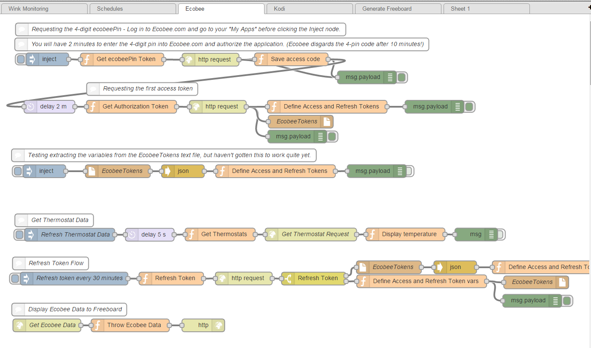

### Customize nodes with your API key and preferred Log location
Edit the `Get ecobeePin Token` function node and add your API key into the `context.global.EcobeeClientID` variable.

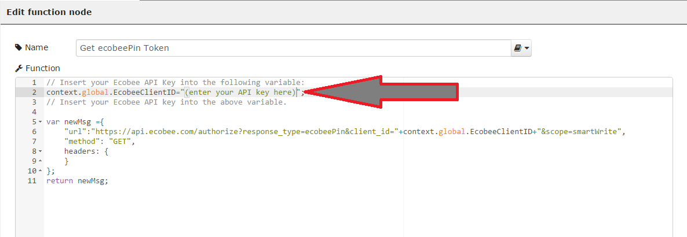

Next we will need to edit each of the `EcobeeTokens` file nodes. Double click each of the `EcobeeTokens` nodes and change the file name to your preferred save location. I personally created a folder on my desktop to save the log file to. Where ever you choose, just make sure it's somewhere that would be writeable by the Node Red app.

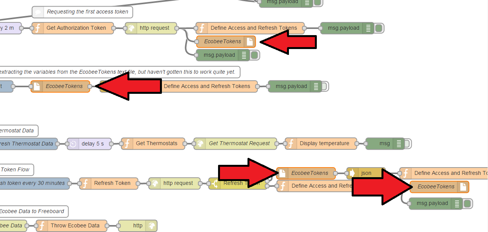

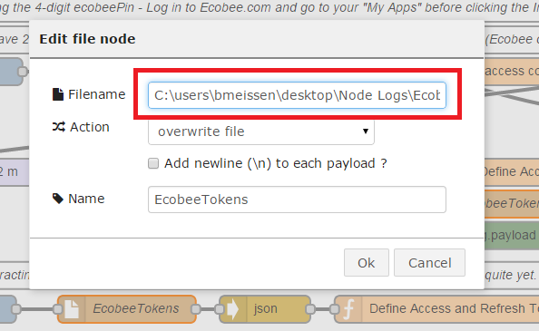

## First Run
If you've made it this far and are following along without trouble -- great! Now is the hard part. :)

Due to the security measures required by Ecobee's API, the first run is a little tricky. I would recommend logging into [Ecobee.com](http://www.ecobee.com/) first, then using the 3-bar menu icon in the top right to select `My Apps` from the menu.

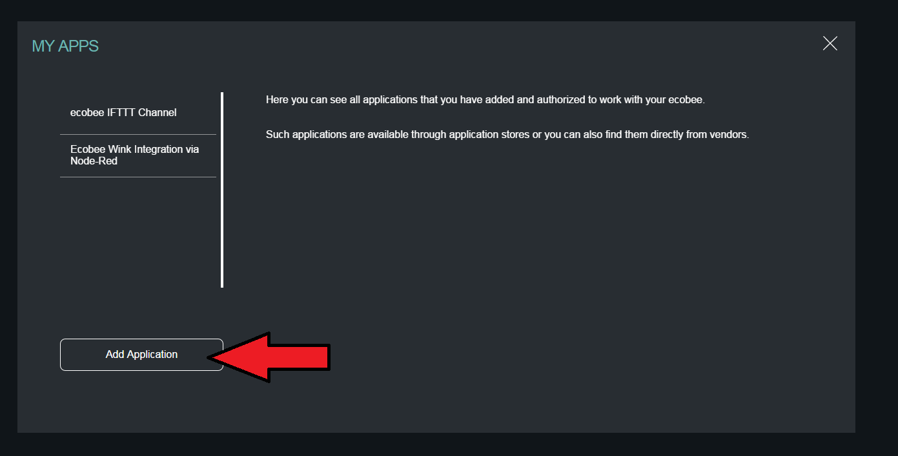

Once logged into [Ecobee.com](http://www.ecobee.com/) and you're at the "My Apps" screen, click on the blue button next to the `Step 1` node at the top of the flow. This will start the process to request the 4-digit pin. ***You have 10 minutes to use the 4-digit pin on Ecobee.com under your `My Apps`*** 

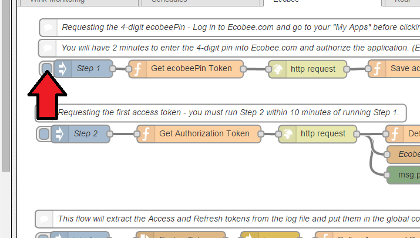

If the flow worked successfully, you'll see an output in the `Debug Tab` which gives you the 4-digit pin. You now have 10 minutes to use this code on the `My Apps` on Ecobee.com.

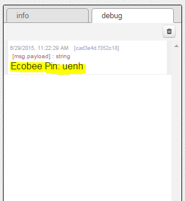

Click `Add Application` on the `My Apps` page, then type the 4-digit pin into the textbox. Click Validate.

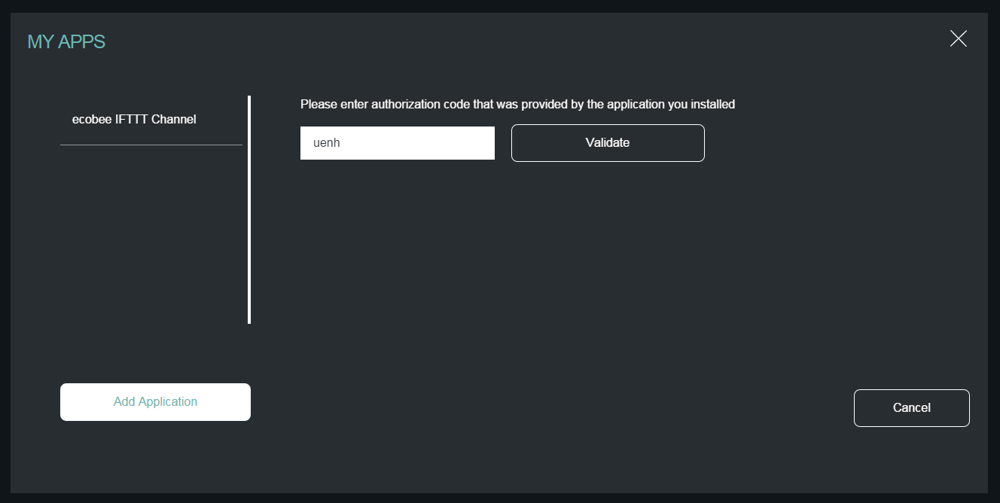

Ecobee with ask you to confirm authorizing the application to be able to view and change the settings on your thermostat. Click the Authorize button in the lower right.

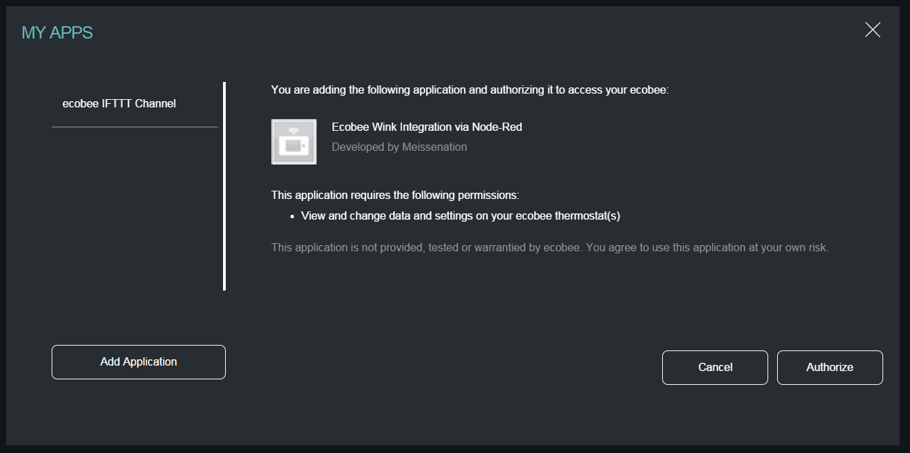

Once authorized, you'll see the application listed on the left side of the `My Apps` page.

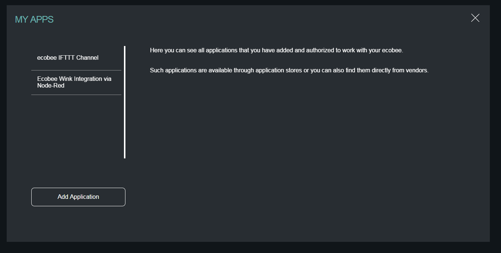

## Refresh Tokens

Once `Step #1` and `Step #2` have been completed, you should now have a log file where you specified earlier which contains your authorization and refresh tokens.

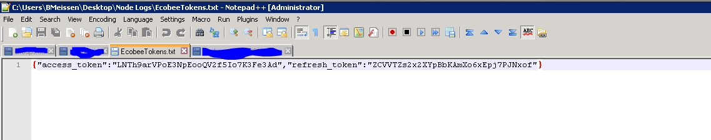

You can run `Step #3` a few times just to make sure that the access token refreshes correctly. When `Step #3` completes, you'll see the updated access and refresh tokens in the debug window.

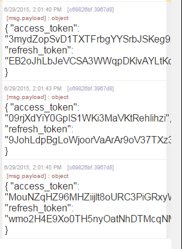

## Get Thermostat Data

Last, but certainly not least, let's get the thermostat data from your Ecobee!

Run `Step #4` - if it completed successfully you'll have a message in the debug window telling you the current temperature at your main Ecobee thermostat. 

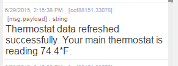

## Conclusion

The main thing you will need to keep in mind is that if your refresh token ever gets lost, you'll have to start all over again from `Step 1`. You'll have to log into Ecobee.com, delete the app from your My Apps, start at `Step #1` and run through each step all over again, adding the new 4-digit pin and getting a new access token. Because of this, the log file is meant to only save the last refresh token received. I have built in an error correction that if Node Red restarts or the refresh token gets to null it will pull the last token from the log and try to use that. If that doesn't work, you'll have to start back at `Step 1`. 

Lastly, I have included a flow for use with Freeboard. If you do not have freeboard already installed with your Node Red application, check out the following tutorial for installing and setting up Freeboard with Node Red.
